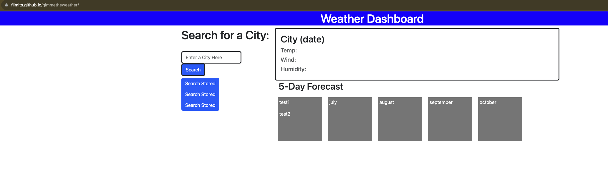

# gimmetheweather
Get a 5-day weather forecast anywhere you are going here.

## Premmis

The purpose of this application is to give the user an opertunity to see what the weather is in any city within the united states. The user should be able to type in a city name and get back today's current temperature and date, then also see a 5 day forecast of similar weather formate. This should then save the search locally and enable the user to easily click  through any saved city and rerun the weather search again.


## Developering the project. 

The project was started by looking at the design and scope from a user-story, and mockup of what it should look like. I was to use technologies talked about over the last week to populate the page. These would include the fetch api, a third-party css toolkit and a third-party API to retreive the weather. I drew out the page layout, using rows and columns to know where css borders where going to be for each page .. WHICH HELPED A TON (not included here :( ).

## Some resources used.

Resouces used were: fetch API.
OpenWeather API
GetBootstrap css library.


## How the program will work

<h2>First you will open up and see a place to search for a city. There will be temp on the right and search bar</h2>




```html for main weather box.
                <form class="form-inline" id="form-inline">
                    <div class="form-group col-md-8">
                        <label class="sr-only col-md-12" for="search-city"></label>
                        <div class="input-group col-md-12">
                            <input type="text" class="form-control border border-dark border-3" id="search-city"
                                placeholder="Enter a City Here">
                        </div>
                    </div>
                    <button type="submit" class="btn btn-primary border border-dark border-3">Search</button>
                </form>
```


## Thoughts on this project

The basic framework is in place and functionality. Some of the functionality is not included, but code was started and commented out in the js so something is at least running.
Did get tutoring and TA help when I could. I'm happy with at least a change in understanding at this point. just need continual practice.

## Where to find this code and website
| Links to Code        | Resource URL           |
| ------------- |:-------------:|
| Gimmetheweather deployed URL | [https://flimits.github.io/gimmetheweather/](https://flimits.github.io/gimmetheweather/)     |
| Gimmetheweather Repo  | [https://github.com/flimits/gimmetheweather](https://github.com/flimits/gimmetheweather) |

## Some Technologies Relyed upon to complete this task
| Technology Used         | Resource URL           |
| ------------- |:-------------:|
| OpenWeather API   | [https://openweathermap.org/guide/](https://openweathermap.org/guide/)     |
| GetBootstrap CSS    | [https://getbootstrap.com/](https://getbootstrap.com/)      |
| CSS W3School for functions    | [https://www.w3schools.com/css](https://www.w3schools.com/css)      |
| Mozilla Web docs for functions | [https://developer.mozilla.org/](https://developer.mozilla.org/en-US/docs/Web/JavaScript/Reference/Global_Objects/Math/floor)
| GitHub | [https://github.com/](https://github.com/)     |
| Docs from Class | Hitting the class notes and materials and drills    |


